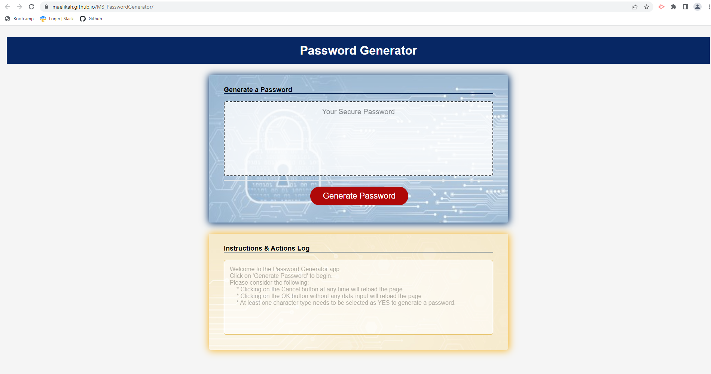

# Password Generator
Password Generation Challenge. The purpose is to create an application with javascript that will generate a random password based on input conditions

</br>


</br>

---

##   📝 Description


---

</br>


Password security is important because passwords are the first line of defense against cybercriminals and their unauthorized access to our personal data. Creating a strong and secure password can reduce the risk of cybercriminals guessing our passwords and accessing sensitive data.

The objective of this application is to allow a user to generate a secure random password based on different input criteria such as: 

- Password Length
- Character Types

This application uses several technologies such as HTML, CSS and JavaScript, being JavaScript the one used the most. 


</br>

---


##   ⌨️ Programming Languages & Technologies
---

</br>

<div style="display: inline_block">


&nbsp;&nbsp;

&nbsp;&nbsp;

&nbsp;&nbsp;


</div>

</br>


---


## 📑 Table of Contents

---

</br>

- [Installation](#💿-installation)
- [Usage](#💻-usage)
- [License](#🔏-license)
- [Credits](#🖋️-credits)
- [Tests](#🧪-tests)
- [User Story](#✍️-user-story)
- [Acceptance Criteria](#👏-acceptance-criteria)


</br>


---

##  💿 [Installation](#📑-table-of-contents)

---

</br>

Installation not required, simply open up the **Password Generator** html file and click on the Generate Password button. Follow the on-screen instructions.

</br>


---

##   💻 [Usage](#📑-table-of-contents)

---

</br>

The webpage should be navigated and after following the prompts, a random password meeting required criteria should be displayed.

<br>

The github URL containing the code for this challenge is located at:

https://github.com/Maelikah/M3_PasswordGenerator/

The github pages URL containing the deployed webpage is located at:

https://maelikah.github.io/M3_PasswordGenerator/

Here is a screenshot of the deployed webpage for reference:

<br>



</br>


---

##  🔏 [License](#📑-table-of-contents)

---

</br>


 This project is licensed under the terms of the `MIT` license. 


</br>


---

## 🖋️ [Credits](#📑-table-of-contents)

---

</br>

JavaScript tutorials:

* https://www.javascripttutorial.net/
* https://www.youtube.com/watch?v=W6NZfCO5SIk
* https://www.youtube.com/watch?v=LDgPTw6tePk
* https://www.freecodecamp.org/learn/javascript-algorithms-and-data-structures/


</br>


---

##   🧪 [Tests](#📑-table-of-contents)

---

</br>


NA


</br>


---

## ✍️ [User Story](#📑-table-of-contents)

---

</br>

```md
AS AN employee with access to sensitive data
I WANT to randomly generate a password that meets certain criteria
SO THAT I can create a strong password that provides greater security
```


</br>

---

## 👏 [Acceptance Criteria](#📑-table-of-contents)

---

</br>


```md
*	GIVEN I need a new, secure password
    *	WHEN I click the button to generate a password
        *	THEN I am presented with a series of prompts for password criteria
    *	WHEN prompted for password criteria
        *	THEN I select which criteria to include in the password
    *	WHEN prompted for the length of the password
        *	THEN I choose a length of at least 8 characters and no more than 128 characters
    *	WHEN asked for character types to include in the password
        *	THEN I confirm whether or not to include lowercase, uppercase, numeric, and/or special characters
    *	WHEN I answer each prompt
        *	THEN my input should be validated and at least one character type should be selected
    *	WHEN all prompts are answered
        *	THEN a password is generated that matches the selected criteria
    *	WHEN the password is generated
        *	THEN the password is either displayed in an alert or written to the page
```

</br>


---

[Back to Top](#password-generator)
